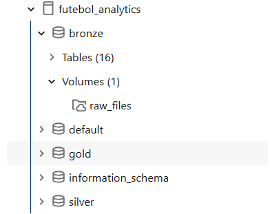
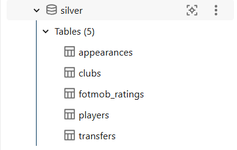
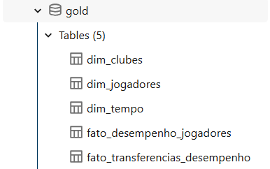
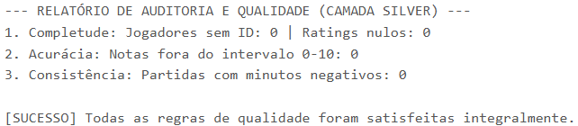
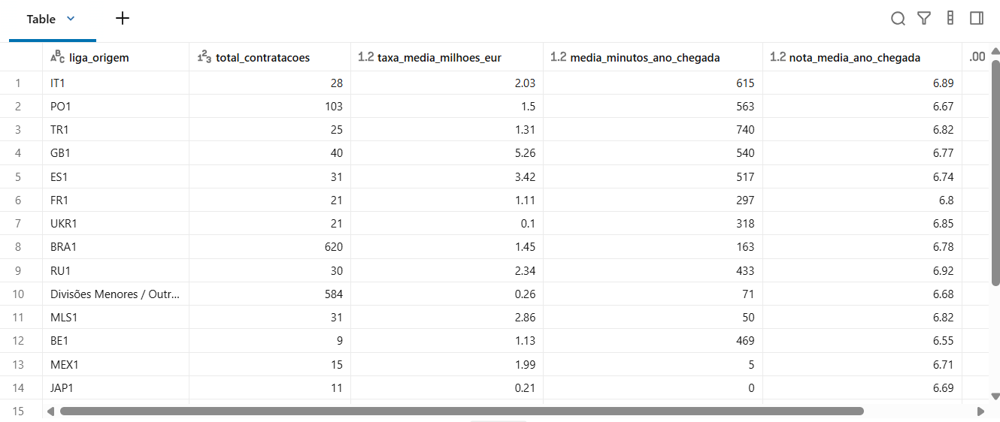
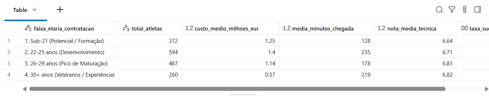
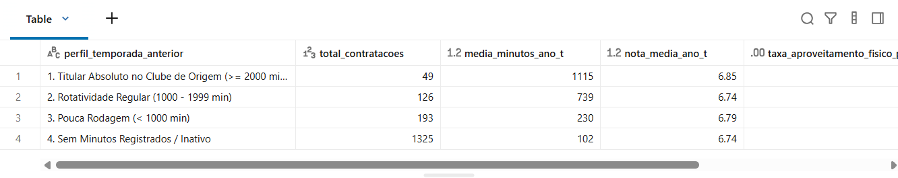
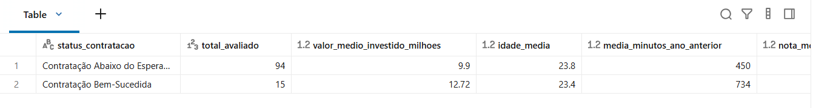

# MVP: Pipeline de Dados na Nuvem - Futebol Analytics

Este repositório contém a implementação completa de um pipeline de dados em nuvem estruturado sobre a **Arquitetura Medalhão (Bronze, Silver e Gold)** no **Databricks Free Edition**, utilizando o **Unity Catalog** para governança centralizada e o **Delta Lake** como camada de armazenamento transacional ACID.

O projeto foi desenhado para resolver um problema real de inteligência esportiva: a **avaliação e previsibilidade do sucesso de contratações e transferências no futebol profissional**, mitigando o risco financeiro de aquisição por meio da análise integrada de minutagem histórica e métricas técnicas de desempenho.

---

## 1. Contexto de Negócios e Perguntas

### Contexto do Problema e Motivação

No futebol de alto rendimento, decisões de transferências envolvem dezenas de milhões de euros e impactam diretamente a sustentabilidade financeira e o desempenho esportivo dos clubes. No entanto, o processo tradicional de *scouting* muitas vezes é enviesado por percepções subjetivas, recortes de curto prazo ou pelo apelo midiático de determinados mercados, sem uma análise empírica sólida sobre os fatores que maximizam a probabilidade de sucesso da contratação.

O objetivo deste projeto é construir um repositório analítico centralizado na nuvem capaz de cruzar dados transacionais de mercado (taxas de transferência, *valuation* e idades) com indicadores físicos e avaliações técnicas estatísticas por partida (notas da FotMob). O pipeline permite avaliar o retorno esportivo na temporada de chegada do atleta ($t$) à luz do seu histórico de utilização na temporada imediatamente anterior ($t-1$).

### Definição Analítica de Sucesso da Contratação

Para viabilizar uma análise objetiva e reproduzível, o sucesso de uma transferência foi parametrizado a partir de uma métrica composta na camada Gold:

* **Aproveitamento Físico (`flag_sucesso_fisico`):** O atleta disputou no mínimo **1.200 minutos** na temporada de chegada ($t$), comprovando adaptação física, disponibilidade e inserção na rotação principal da equipe.
* **Consistência Técnica (`flag_sucesso_tecnico`):** O jogador sustentou uma **nota média anual ponderada $\ge 6.80$** nas avaliações estatísticas da FotMob.
* **Sucesso Consolidado (`flag_sucesso_consolidado`):** Atendimento simultâneo dos critérios físico e técnico no primeiro ano de contratação.

### Perguntas de Negócio

1. **Qual a influência da liga de origem do atleta?** Em quais campeonatos de saída os jogadores apresentam a maior taxa de adaptação e sucesso no clube adquirente?
2. **Qual a influência da idade do atleta no momento da contratação?** Qual faixa etária entrega o melhor equilíbrio entre custo de aquisição e retorno esportivo imediato?
3. **O volume de minutagem na temporada anterior ($t-1$) é um bom preditor de sucesso no ano $t$?** Atletas que atuavam como titulares absolutos no clube de origem sustentam maior probabilidade de sucesso na nova equipe em comparação a jogadores de baixa minutagem?
4. **Para uma mesma faixa de custo (5M € a 25M €), quais fatores aumentam a probabilidade de sucesso?** O que diferencia objetivamente as contratações que deram certo daquelas que não atingiram os objetivos esportivos sob investimentos financeiros equivalentes?

---

### Estrutura dos Dados Brutos

O pipeline integra dados provenientes de duas fontes de dados abertas:

1. **Dataset Kaggle (Transfermarkt Football Dataset):**
* `transfers`: Histórico transacional de transferências (atleta, clubes de origem e destino, data, taxa paga e valor de mercado).
* `players`: Cadastro mestre do atleta (data de nascimento, nacionalidade, posição, altura, pé preferencial).
* `appearances`: Registro detalhado por partida disputada (minutos em campo, gols, assistências, cartões).
* `clubs` e `competitions`: Cadastro institucional das equipes e ligas nacionais.


2. **Dataset FotMob (Ratings de Partidas 2022 a 2025):**
* Avaliações estatísticas individuais dos jogadores em partidas oficiais das principais competições internacionais.
* Atributos essenciais: `player_name`, `rating` (escala contínua de 0 a 10), `match_year`, `season`, `match_time_utc`.


### Licença dos Dados e do Código

* **Dataset Transfermarkt (Kaggle):** Open Data Commons Open Database License (ODbL) / CC0 Public Domain.
* **Dataset FotMob:** Dados públicos consolidados exclusivamente para finalidades acadêmicas e de pesquisa.
* **Código do Projeto:** Licença MIT.

---

## 2. Carga dos Dados

### Infraestrutura de Nuvem e Desafios de Conectividade

O pipeline foi implementado no **Databricks Free Edition**, operando sobre a nuvem da **AWS**.

Durante a etapa de ingestão, foi diagnosticado que o plano gratuito do Databricks aplica restrições de segurança que bloqueiam a resolução de DNS para a rede externa (`gaierror: [Errno -3] Temporary failure in name resolution`), inviabilizando requisições HTTP diretas e rotinas de *web scraping* em tempo de execução no cluster.

```text
HTTPSConnectionPool(host='www.sofascore.com', port=443): Max retries exceeded with url: /api/v1/...
(Caused by NameResolutionError: Failed to resolve 'www.sofascore.com')

```

Para garantir a reprodutibilidade e a integridade da arquitetura em nuvem, a estratégia de ingestão foi estruturada em dois fluxos segregados:

1. **Ingestão Batch via Kaggle API:** Execução programática via biblioteca oficial, persistindo as tabelas do Transfermarkt diretamente no schema `futebol_analytics.bronze`.
2. **Ingestão via Volumes do Unity Catalog:** Upload dos arquivos analíticos de notas para o volume seguro da Landing Zone:
```text
/Volumes/futebol_analytics/bronze/raw_files/

```


A partir dessa área de pouso, scripts PySpark realizaram a carga incremental e a conversão dos arquivos brutos para o formato Delta Lake nativo, incorporando metadados de auditoria (`_ingested_at`, `_source_file`).

### Notebooks de Carga (GitHub)

* `00_setup_governanca_catalogo.ipynb`: Provisionamento do catálogo e permissões.
* `01_bronze_ingestao_kaggle.ipynb`: Ingestão das entidades transacionais.
* `01_bronze_ingestao_fotmob.ipynb`: Ingestão e conversão dos ratings históricos para Delta Lake.

---

## 3. Modelagem e Catálogo de Dados

### Governança com Unity Catalog e Arquitetura Medalhão

O ambiente de dados adota a segregação de três camadas sob o catálogo dedicado **`futebol_analytics`**:

* **Bronze:** Armazenamento bruto das 16 tabelas originais e do volume `raw_files`, preservando a fidelidade da fonte.
* **Silver:** Tabelas higienizadas, deduplicadas, tipadas e enriquecidas com padronização textual e chaves de junção.
* **Gold:** Modelagem dimensional em **Esquema Estrela (*Star Schema*)**, otimizada para consultas analíticas de alta performance e suporte a decisões de *scouting*.

```text
               ┌─────────────────────────────────────┐
               │         dim_tempo (Gold)            │
               │   (ano, temporada, sk_tempo)        │
               └──────────────────┬──────────────────┘
                                  │
┌─────────────────────────┐       │       ┌─────────────────────────┐
│   dim_jogadores (Gold)  │       │       │    dim_clubes (Gold)    │
│(player_id, nome, idade, ├───────┼───────┤(club_id, nome, liga,    │
│ posição, valor_mercado) │       │       │ estádio, valuation)     │
└─────────────────────────┘       │       └─────────────────────────┘
                                  │
               ┌──────────────────┴──────────────────┐
               │  fato_transferencias_desempenho     │
               │               (Gold)                │
               │ ----------------------------------- │
               │ sk_fato_transferencia (PK)          │
               │ player_id, from_club_id, to_club_id │
               │ ano_transferencia, transfer_fee     │
               │ minutos_jogados_t_minus_1           │
               │ minutos_jogados_ano_t               │
               │ nota_media_ano_t, participacoes_gols│
               │ flag_sucesso_fisico, flag_tecnico   │
               │ flag_sucesso_consolidado            │
               └─────────────────────────────────────┘

```

### Dicionário de Dados das Entidades Principais

| Tabela | Camada | Campo | Tipo | Descrição Técnica |
| --- | --- | --- | --- | --- |
| `silver.transfers` | Silver | `player_id` | Long | Identificador único do atleta no Transfermarkt |
| `silver.transfers` | Silver | `transfer_date` | Date | Data da conclusão da negociação |
| `silver.transfers` | Silver | `transfer_fee` | Double | Taxa de transferência paga em euros |
| `silver.transfers` | Silver | `from_club_id` / `to_club_id` | Long | Chaves de associação aos clubes envolvidos |
| `silver.fotmob_ratings` | Silver | `player_name_clean` | String | Nome do jogador tratado para reconciliação textual |
| `silver.fotmob_ratings` | Silver | `rating` | Double | Avaliação estatística da partida (0.00 a 10.00) |
| `silver.appearances` | Silver | `minutes_played` | Long | Minutos disputados pelo jogador na partida |
| `gold.dim_jogadores` | Gold | `market_value_in_eur` | Double | Valor de mercado de referência do atleta |
| `gold.dim_jogadores` | Gold | `date_of_birth` | Date | Data de nascimento para derivação da idade |
| `gold.fato_transferencias_desempenho` | Gold | `minutos_jogados_t_minus_1` | Long | Minutagem total na temporada anterior à compra |
| `gold.fato_transferencias_desempenho` | Gold | `minutos_jogados_ano_t` | Long | Minutagem total no clube comprador no ano de chegada |
| `gold.fato_transferencias_desempenho` | Gold | `nota_media_ano_t` | Double | Nota média ponderada FotMob na temporada de chegada |
| `gold.fato_transferencias_desempenho` | Gold | `flag_sucesso_consolidado` | Integer | Booleano (1/0): $\ge 1200$ min e nota $\ge 6.80$ em $t$ |



---

## 4. Pipeline de Dados

### Orquestração dos Notebooks e Linhagem de Dados

O ciclo de transformação de dados opera em etapas modulares, garantindo rastreabilidade e isolamento de falhas:

1. **`00_setup_governanca_catalogo.ipynb`:** Provisionamento do catálogo `futebol_analytics`, criação dos schemas e migração controlada de dados legados via `DEEP CLONE`.
2. **`01_bronze_ingestao_kaggle.ipynb`:** Carga em lote das tabelas transacionais do Transfermarkt, com aplicação de carimbos temporais de linhagem (`_ingested_at`).
3. **`01_bronze_ingestao_fotmob.ipynb`:** Varredura do volume de arquivos brutos, unificação dos anos 2022 a 2025 via `unionByName` e conversão para Delta Lake.
4. **`02_silver_limpeza_qualidade.ipynb`:** Limpeza de dados, aplicação de regras de validação, padronização de datas, tratamento de nulos e persistência das entidades auditadas (`players`, `clubs`, `appearances`, `fotmob_ratings`, `transfers`).
5. **`03_gold_modelagem_dimensional.ipynb`:** Criação das dimensões desacopladas e processamento da tabela fato central (`fato_transferencias_desempenho`) consolidando o histórico temporal ($t$ e $t-1$) para **66.023 contratações**.
6. **`04_analise_dados.ipynb`:** Execução das consultas analíticas em SQL para responder às perguntas de negócio.

### Armazenamento e Propriedades ACID

Todas as tabelas são gerenciadas sob o formato aberto **Delta Lake**, garantindo:

* **Garantias ACID:** Transações atômicas com controle de concorrência multiversão (MVCC).
* **Proteção de Esquema (*Schema Enforcement*):** Prevenção de corrupção estrutural de tabelas durante atualizações de pipeline.
* **Metadados de Linhagem:** Cada camada mantém colunas técnicas (`_ingested_at`, `_transformed_at`, `_created_at`) registrando a cronologia do processamento.




---

## 5. Qualidade de Dados

As rotinas de saneamento e auditoria foram consolidadas no notebook `02_silver_limpeza_qualidade.ipynb`, validando as seguintes dimensões de qualidade:

### 1. Completude

* **Problema:** Existência de registros de transações sem chave identificadora de atleta ou sem data de realização.
* **Tratamento:** Filtro estrito `col("player_id").isNotNull() & col("transfer_date").isNotNull()`. Preenchimento de valores financeiros nulos via `.fillna({"transfer_fee": 0, "market_value_in_eur": 0})`.

### 2. Unicidade

* **Problema:** Registros repetidos originados por cargas concorrentes ou duplicidade na fonte.
* **Tratamento:** Deduplicação explícita por grão de negócio:
```python
df_transfers.dropDuplicates(["player_id", "transfer_date", "to_club_id"])
df_players.dropDuplicates(["player_id"])
df_appearances.dropDuplicates(["appearance_id"])

```


### 3. Consistência e Padronização

* **Problema:** Datas armazenadas como strings e discrepâncias de espaçamento/caixa em nomes de atletas.
* **Tratamento:** Conversão explícita para o tipo de dado `DateType` com máscara `yyyy-MM-dd` e normalização textual:
```python
to_date(col("transfer_date"), "yyyy-MM-dd")
lower(trim(col("player_name")))

```


### 4. Acurácia e Conformidade de Faixa

* **Problema:** Notas estatísticas da FotMob geradas fora da escala permitida (0 a 10).
* **Tratamento:** Validação por predicado relacional:
```python
col("rating").between(0.0, 10.0)

```


### 5. Regras de Negócio e Validação de Minutagem

* **Problema:** Anomalias em minutos jogados (valores negativos).
* **Tratamento:** Filtro de integridade física `minutes_played >= 0`.

### Resultado da Auditoria Automatizada na Camada Silver

```text
--- RELATÓRIO DE AUDITORIA E QUALIDADE (CAMADA SILVER) ---
1. Completude: Jogadores sem ID: 0 | Ratings nulos: 0
2. Acurácia: Notas fora do intervalo 0-10: 0
3. Consistência: Partidas com minutos negativos: 0

[SUCESSO] Todas as regras de qualidade foram satisfeitas integralmente.

```



---

## 6. Análise de Dados e Resposta às Perguntas de Negócio

### Pergunta 1: Qual a influência da liga de origem do atleta?

#### Consulta SQL

```sql
SELECT 
    COALESCE(c_origem.domestic_competition_id, 'Divisões Menores / Outras') AS liga_origem,
    COUNT(*) AS total_contratacoes,
    ROUND(AVG(f.transfer_fee) / 1000000, 2) AS taxa_media_milhoes_eur,
    ROUND(AVG(f.minutos_jogados_ano_t), 0) AS media_minutos_ano_chegada,
    ROUND(AVG(f.nota_media_ano_t), 2) AS nota_media_ano_chegada,
    ROUND(100.0 * SUM(f.flag_sucesso_consolidado) / COUNT(*), 1) AS taxa_sucesso_pct
FROM fato_transferencias_desempenho f
LEFT JOIN dim_clubes c_origem ON f.from_club_id = c_origem.club_id
WHERE f.nota_media_ano_t IS NOT NULL
GROUP BY 1
HAVING COUNT(*) >= 5
ORDER BY taxa_sucesso_pct DESC;

```

#### Resultados Empíricos

| Liga de Origem | Contratações Avaliadas | Taxa Média (M €) | Minutagem no Ano $t$ | Nota Média | Taxa de Sucesso (%) |
| --- | --- | --- | --- | --- | --- |
| **Itália (IT1)** | 28 | 2.03 | 615 min | 6.89 | **14.3%** |
| **Portugal (PO1)** | 103 | 1.50 | 563 min | 6.67 | **12.6%** |
| **Turquia (TR1)** | 25 | 1.31 | 740 min | 6.82 | **12.0%** |
| **Inglaterra (GB1)** | 40 | 5.26 | 540 min | 6.77 | **10.0%** |
| **Espanha (ES1)** | 31 | 3.42 | 517 min | 6.74 | **9.7%** |
| **França (FR1)** | 21 | 1.11 | 297 min | 6.80 | **9.5%** |
| **Brasil (BRA1)** | 620 | 1.45 | 163 min | 6.78 | **4.5%** |
| **Divisões Menores / Outras** | 584 | 0.26 | 71 min | 6.68 | **0.7%** |

#### Discussão e Insights de Negócio

* **Eficiência dos Mercados Europeus Estruturados:** Atletas provenientes de ligas como a Série A Italiana (14.3%) e a Primeira Liga Portuguesa (12.6%) apresentaram taxas de sucesso quase **três vezes superiores** às de atletas saídos diretamente da Série A Brasileira (4.5%). Isso decorre da proximidade tática e da intensidade física do futebol europeu.
* **Portugal como Hub de Liquidez e Baixo Risco:** Com 103 transferências analisadas e taxa média controlada (1.5M €), Portugal destaca-se como o melhor mercado para redução de risco esportivo, combinando minutagem expressiva no destino (563 min) com alta taxa de acerto.
* **O Perigo do Recrutamento Periférico:** Jogadores contratados de divisões periféricas ou sem cobertura de elite apresentaram taxa de sucesso consolidado de apenas **0.7%** e minutagem residual (71 min), comprovando que a assimetria competitiva dificulta a inserção direta de atletas no alto rendimento.



---

### Pergunta 2: Qual a influência da idade do atleta no momento da contratação?

#### Consulta SQL

```sql
SELECT 
    CASE 
        WHEN (f.ano_transferencia - YEAR(d.date_of_birth)) <= 21 THEN '1. Sub-21 (Potencial / Formação)'
        WHEN (f.ano_transferencia - YEAR(d.date_of_birth)) BETWEEN 22 AND 25 THEN '2. 22-25 anos (Desenvolvimento)'
        WHEN (f.ano_transferencia - YEAR(d.date_of_birth)) BETWEEN 26 AND 29 THEN '3. 26-29 anos (Pico de Maturação)'
        ELSE '4. 30+ anos (Veteranos / Experiência)'
    END AS faixa_etaria_contratacao,
    COUNT(*) AS total_atletas,
    ROUND(AVG(f.transfer_fee) / 1000000, 2) AS custo_medio_milhoes_eur,
    ROUND(AVG(f.minutos_jogados_ano_t), 0) AS media_minutos_chegada,
    ROUND(AVG(f.nota_media_ano_t), 2) AS nota_media_tecnica,
    ROUND(100.0 * SUM(f.flag_sucesso_consolidado) / COUNT(*), 1) AS taxa_sucesso_pct
FROM fato_transferencias_desempenho f
INNER JOIN dim_jogadores d ON f.player_id = d.player_id
WHERE d.date_of_birth IS NOT NULL 
  AND f.nota_media_ano_t IS NOT NULL
GROUP BY 1
ORDER BY 1 ASC;

```

#### Resultados Empíricos

| Faixa Etária | Total Atletas | Custo Médio (M €) | Minutos Ano $t$ | Nota Média | Taxa de Sucesso (%) |
| --- | --- | --- | --- | --- | --- |
| **1. Sub-21 (Potencial / Formação)** | 372 | 1.25 | 128 min | 6.64 | **2.2%** |
| **2. 22–25 anos (Desenvolvimento)** | 594 | 1.40 | 235 min | 6.71 | **4.7%** |
| **3. 26–29 anos (Pico de Maturação)** | 467 | 1.14 | 178 min | 6.83 | **4.3%** |
| **4. 30+ anos (Veteranos / Experiência)** | 260 | 0.57 | 219 min | 6.82 | **3.8%** |

#### Discussão e Insights de Negócio

* **A Janela Ótima de Recrutamento (22 a 25 anos):** Essa faixa representa a maior probabilidade de retorno esportivo imediato (**4.7%** de sucesso consolidado) e o maior volume médio de minutos jogados (235 min), associando maturidade física com plasticidade tática de adaptação.
* **O Paradoxo do Sub-21:** Atletas até 21 anos entregam a menor taxa de sucesso no ano de chegada (**2.2%**), com a menor nota técnica (6.64) e baixa minutagem (128 min). Investir nessa faixa etária deve ser compreendido como uma aposta patrimonial de longo prazo, e não como solução para carências imediatas do elenco.
* **Custo-Benefício dos Veteranos (30+):** Jogadores acima de 30 anos apresentaram alta estabilidade técnica (nota 6.82) e minutagem competitiva (219 min), custando menos da metade de um atleta sub-25 (0.57M € contra 1.40M €), consolidando-se como opções táticas de baixo custo.



---

### Pergunta 3: O volume de minutagem na temporada anterior ($t-1$) é um bom preditor de sucesso no ano $t$?

#### Consulta SQL

```sql
SELECT 
    CASE 
        WHEN f.minutos_jogados_t_minus_1 >= 2000 THEN '1. Titular Absoluto no Clube de Origem (>= 2000 min)'
        WHEN f.minutos_jogados_t_minus_1 BETWEEN 1000 AND 1999 THEN '2. Rotatividade Regular (1000 - 1999 min)'
        WHEN f.minutos_jogados_t_minus_1 > 0 THEN '3. Pouca Rodagem (< 1000 min)'
        ELSE '4. Sem Minutos Registrados / Inativo'
    END AS perfil_temporada_anterior,
    COUNT(*) AS total_contratacoes,
    ROUND(AVG(f.minutos_jogados_ano_t), 0) AS media_minutos_ano_t,
    ROUND(AVG(f.nota_media_ano_t), 2) AS nota_media_ano_t,
    ROUND(100.0 * SUM(f.flag_sucesso_fisico) / COUNT(*), 1) AS taxa_aproveitamento_fisico_pct,
    ROUND(100.0 * SUM(f.flag_sucesso_consolidado) / COUNT(*), 1) AS taxa_sucesso_consolidado_pct
FROM fato_transferencias_desempenho f
WHERE f.nota_media_ano_t IS NOT NULL
GROUP BY 1
ORDER BY 1 ASC;

```

#### Resultados Empíricos

| Perfil Temporada Anterior ($t-1$) | Total Contratações | Minutos Ano $t$ | Nota Média | Aproveitamento Físico | Sucesso Consolidado |
| --- | --- | --- | --- | --- | --- |
| **1. Titular Absoluto ($\ge 2.000$ min)** | 49 | 1.115 min | 6.85 | **40.8%** | **22.4%** |
| **2. Rotatividade Regular (1.000–1.999 min)** | 126 | 739 min | 6.74 | **26.2%** | **12.7%** |
| **3. Pouca Rodagem ($< 1.000$ min)** | 193 | 230 min | 6.79 | **5.7%** | **4.7%** |
| **4. Sem Minutos Registrados / Inativo** | 1.325 | 102 min | 6.74 | **3.3%** | **2.3%** |

#### Discussão e Insights de Negócio

* **O Preditor Mais Poderoso do Pipeline:** A minutagem prévia é a variável isolada com maior poder de previsão de sucesso. Um atleta com mais de 2.000 minutos no ano anterior tem **quase 10 vezes mais chances de sucesso consolidado (22.4%)** em relação a um jogador inativo ou sem registro (2.3%).
* **Persistência de Ritmo Competitivo:** Mais de 40% dos titulares absolutos mantiveram alta minutagem ($\ge 1.200$ min) no novo clube. Em contrapartida, atletas que vinham de inatividade raramente superaram 102 minutos em campo, evidenciando que o déficit de ritmo de jogo e histórico físico tende a se perpetuar após a transferência.



---

### Pergunta 4: Para uma mesma faixa de custo (5M € a 25M €), quais fatores aumentam a probabilidade de sucesso?

#### Consulta SQL

```sql
SELECT 
    CASE 
        WHEN f.flag_sucesso_consolidado = 1 THEN 'Contratação Bem-Sucedida' 
        ELSE 'Contratação Abaixo do Esperado' 
    END AS status_contratacao,
    COUNT(*) AS total_avaliado,
    ROUND(AVG(f.transfer_fee) / 1000000, 2) AS valor_medio_investido_milhoes,
    ROUND(AVG(f.ano_transferencia - YEAR(d.date_of_birth)), 1) AS idade_media,
    ROUND(AVG(f.minutos_jogados_t_minus_1), 0) AS media_minutos_ano_anterior,
    ROUND(AVG(f.nota_media_ano_t), 2) AS nota_media_ano_t,
    ROUND(AVG(f.gols_assistencias_ano_t), 1) AS media_participacoes_gols
FROM fato_transferencias_desempenho f
INNER JOIN dim_jogadores d ON f.player_id = d.player_id
WHERE f.transfer_fee BETWEEN 5000000 AND 25000000
  AND f.nota_media_ano_t IS NOT NULL
GROUP BY 1;

```

#### Resultados Empíricos

| Status da Contratação | Total Avaliado | Investimento Médio | Idade Média | Minutos no Ano Anterior ($t-1$) | Nota Média | Gols + Assistências |
| --- | --- | --- | --- | --- | --- | --- |
| **Abaixo do Esperado** | 94 | 9.90M € | 23.8 anos | 450 min | 6.86 | 1.5 |
| **Bem-Sucedida** | 15 | 12.72M € | 23.4 anos | **734 min** | **7.13** | **5.5** |

#### Discussão e Insights de Negócio

* **O Histórico Físico Supera a Variável Idade:** Ambos os grupos apresentam idade média similar (~23.5 anos), demonstrando que a idade, isoladamente, não explica o fracasso em contratações de valor expressivo. A diferença reside na rodagem: o grupo bem-sucedido disputou **63% mais minutos na temporada anterior** (734 min contra 450 min).
* **Retorno em Produtividade Ofensiva:** O investimento marginalmente superior pago nos atletas bem-sucedidos (12.72M € vs. 9.90M €) traduziu-se em quase **quatro vezes mais participações em gols** (5.5 vs. 1.5), provando que pagar um prêmio financeiro por atletas em ritmo competitivo ativo compensa o risco da operação.



---

## 7. Autoavaliação e Considerações Finais

### Atingimento dos Objetivos

O projeto cumpriu integralmente os requisitos propostos para o MVP de Engenharia de Dados em Nuvem:

* **Execução em Nuvem:** Pipeline executado de ponta a ponta na infraestrutura AWS via Databricks Free Edition, sem uso de ferramentas locais ou do Google Colab.
* **Governança Centralizada:** Catálogo `futebol_analytics` estruturado no Unity Catalog, assegurando segregação rigorosa nas camadas Medalhão (`bronze`, `silver`, `gold`).
* **Modelagem Estrela Validada:** Criação da tabela `gold.fato_transferencias_desempenho` com **66.023 contratações** populadas, enriquecidas com janelas temporais ($t$ e $t-1$) e métricas de sucesso técnico e físico.
* **Resolução do Problema de Negócio:** Extração de respostas quantitativas e recomendações estratégicas para clubes de futebol mitigarem riscos financeiros em contratações de atletas.

### Dificuldades Encontradas e Soluções Adotadas

1. **Restrições de Resolução de DNS no Databricks Free Edition:**
* *Desafio:* O cluster do Databricks bloqueava conexões de saída (*egress DNS*), impedindo scraping direto via APIs.
* *Solução de Engenharia:* Implementação de uma *Landing Zone* baseada em Volumes do Unity Catalog (`/Volumes/futebol_analytics/bronze/raw_files/`), viabilizando a ingestão controlada de arquivos brutos e posterior conversão para Delta Lake.


2. **Conflito de Metadados e Evolução de Esquema (`DELTA_METADATA_MISMATCH`):**
* *Desafio:* A inclusão das métricas históricas de $t-1$ alterou a assinatura das colunas da tabela fato original, acionando a proteção de esquema nativa do Delta Lake.
* *Solução de Engenharia:* Limpeza programática da definição legada no metastore (`DROP TABLE IF EXISTS`) e gravação controlada utilizando a diretiva explícita `.option("overwriteSchema", "true")`.


3. **Isolamento de Catálogo e Linhagem Segura:**
* *Desafio:* Necessidade de isolar tabelas do metastore padrão `workspace` para um catálogo governado.
* *Solução de Engenharia:* Execução de comandos `DEEP CLONE` para migração atômica de metadados e arquivos de dados físicos para o catálogo `futebol_analytics`.


### Trabalhos Futuros

* **Automação com Databricks Workflows:** Agendamento periódico de *Jobs* para ingestão de novas janelas de transferências à medida que novas temporadas se encerram.
* **Camada de Qualidade com Delta Live Tables (DLT):** Substituição dos testes manuais de qualidade por expectativas declarativas (*Expectations*) automatizadas no fluxo de ingestão.
* **Modelos Preditivos de Machine Learning:** Utilização das variáveis comprovadas neste estudo (minutagem em $t-1$, liga de origem e idade) para treinar modelos supervisionados (ex: XGBoost/Random Forest via MLflow) que calculem o escore de probabilidade de sucesso de uma contratação antes do fechamento do contrato.
* **Camada Semântica e Visualização:** Conexão direta do schema `gold` a ferramentas de BI (Power BI ou Databricks Dashboards) para consumo executivo por departamentos de scout e diretorias de futebol.
